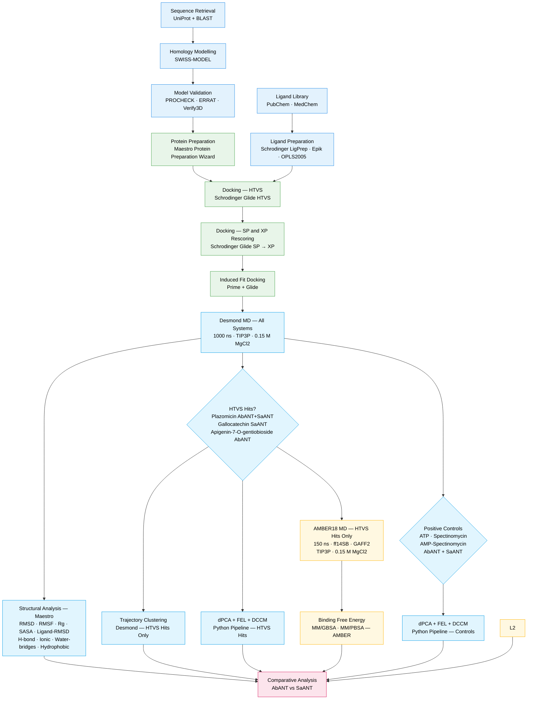

# Computational Pipeline: Methods Overview

This document outlines the full computational workflow used to investigate the conformational dynamics and binding energetics of aminoglycoside nucleotidyltransferase ANT(3″)-Ia from *Acinetobacter baumannii* (AbANT) versus its *Staphylococcus aureus* (SaANT) orthologue.

---

## Pipeline Diagram

---

## Stage Descriptions

### 1. Sequence Retrieval and Homology Modelling
Target sequences for AbANT (UniProt Q671Q4) and SaANT (UniProt P0A0D2) were retrieved from UniProt and verified via BLAST. Homology models were constructed using SWISS-MODEL and validated with PROCHECK (Ramachandran statistics), ERRAT (non-bonded atomic interactions), and Verify3D (3D–1D profile scoring).

### 2. Ligand Preparation and Molecular Docking
Ligand libraries were sourced from PubChem and MedChem databases. Ligands were prepared using Schrödinger LigPrep with Epik for ionisation state enumeration at physiological pH, applying the OPLS2005 force field. Protein structures were prepared using the Maestro Protein Preparation Wizard. Docking was performed hierarchically: High-Throughput Virtual Screening (HTVS), followed by Standard Precision (SP) and Extra Precision (XP) rescoring using Glide. Top-ranked poses were subjected to Induced Fit Docking (IFD) using Prime and Glide to account for receptor flexibility.

### 3. Desmond MD Simulations: All Systems (1000 ns)
All docked protein–ligand complexes were simulated for 1000 ns using Schrödinger Desmond with TIP3P explicit solvent and 0.15 M MgCl₂. This included the four HTVS-selected hits and the positive control systems (ATP, Spectinomycin, and AMP-Spectinomycin for both AbANT and SaANT).

#### 3.1 Structural Analysis: All Systems (Maestro)
Standard structural metrics were computed within the Desmond/Maestro environment for all systems:
- Per-frame RMSD and per-residue RMSF
- Radius of gyration (Rg) and solvent-accessible surface area (SASA)
- Ligand RMSD
- Protein–ligand interaction fractions: hydrogen bonds, ionic interactions, water bridges, and hydrophobic contacts

#### 3.2 Trajectory Clustering: HTVS Hits Only
Trajectory clustering was performed within Desmond/Maestro for the four HTVS-selected systems (Plazomicin · AbANT, Plazomicin · SaANT, Gallocatechin · SaANT, and Apigenin-7-O-(2G-rhamnosyl)gentiobioside · AbANT) to identify representative conformational states sampled during simulation.

#### 3.3 dPCA, FEL, and DCCM: HTVS Hits and Positive Controls (Python Pipeline)
Dihedral Principal Component Analysis (dPCA), Free Energy Landscape (FEL), and Dynamic Cross-Correlation Matrix (DCCM) analyses were performed using a custom Python pipeline on Desmond 1000 ns trajectories for:
- Plazomicin · AbANT and SaANT
- Gallocatechin · SaANT
- Apigenin-7-O-(2G-rhamnosyl)gentiobioside · AbANT
- ATP · AbANT and SaANT *(positive controls)*
- Spectinomycin · AbANT and SaANT *(positive controls)*
- AMP-Spectinomycin · AbANT and SaANT *(positive controls)*

dPCA was performed using sin/cos transformation of backbone dihedral angles (φ/ψ) following Altis et al. (2007), implemented in MDAnalysis with StandardScaler normalisation and scikit-learn PCA. FEL was constructed via Boltzmann inversion of the PC1/PC2 probability density. DCCM was computed from Cα positional fluctuations to map correlated and anti-correlated residue motions.

### 4. AMBER18 MD Simulations: HTVS Hits Only (150 ns)
The four HTVS-selected systems were independently re-simulated using the AMBER18 suite for 150 ns to enable MM/GBSA binding free energy calculations and cross-platform validation of conformational dynamics. Systems were parameterised with the ff14SB force field for proteins and GAFF2 for small molecules, solvated in a TIP3P explicit water box with 0.15 M MgCl₂.

Systems simulated:
- Plazomicin · AbANT
- Plazomicin · SaANT
- Gallocatechin · SaANT
- Apigenin-7-O-(2G-rhamnosyl)gentiobioside · AbANT

#### 4.1 Binding Free Energy: MM/GBSA and MM/PBSA
MM/GBSA and MM/PBSA binding free energy calculations were performed on representative snapshots extracted from stable AMBER trajectory windows for the four HTVS-selected systems. Positive control systems were excluded from this analysis.

### 5. Comparative Analysis
All structural, conformational, dynamic, and energetic metrics were integrated and compared between AbANT and SaANT, and between HTVS-selected ligands and positive controls, to identify determinants of differential inhibitor selectivity across the two enzymes.

---

## System Summary

| System | Desmond 1000 ns | AMBER 150 ns | Clustering | dPCA/FEL/DCCM | MM/GBSA |
|---|:---:|:---:|:---:|:---:|:---:|
| Plazomicin · AbANT | ✓ | ✓ | ✓ | ✓ | ✓ |
| Plazomicin · SaANT | ✓ | ✓ | ✓ | ✓ | ✓ |
| Gallocatechin · SaANT | ✓ | ✓ | ✓ | ✓ | ✓ |
| Apigenin-7-O-(2G-rhamnosyl)gentiobioside · AbANT | ✓ | ✓ | ✓ | ✓ | ✓ |
| ATP · AbANT | ✓ | — | — | ✓ | — |
| ATP · SaANT | ✓ | — | — | ✓ | — |
| Spectinomycin · AbANT | ✓ | — | — | ✓ | — |
| Spectinomycin · SaANT | ✓ | — | — | ✓ | — |
| AMP-Spectinomycin · AbANT | ✓ | — | — | ✓ | — |
| AMP-Spectinomycin · SaANT | ✓ | — | — | ✓ | — |

---

## Software and Resources

| Tool / Resource | Purpose |
|---|---|
| UniProt / BLAST | Sequence retrieval and homology search |
| SWISS-MODEL | Homology modelling |
| PROCHECK, ERRAT, Verify3D | Model validation |
| Schrödinger Suite (LigPrep, Glide, Prime, Maestro) | Ligand preparation, docking, IFD, structural analysis, clustering |
| Schrödinger Desmond | 1000 ns MD simulations |
| AMBER18 (ff14SB, GAFF2) | 150 ns MD simulations and MM/GBSA |
| MDAnalysis | Trajectory parsing and dPCA |
| scikit-learn | PCA and K-Means clustering |
| Python (NumPy, SciPy, Matplotlib, Seaborn) | Analysis and visualisation |

---

## Analysis Scripts

All post-dynamics analysis scripts are available in this repository:

| Script | Description |
|---|---|
| `RMSD.py` | Per-frame RMSD calculation |
| `RMSF.py` | Per-residue RMSF calculation |
| `ROG.py` | Radius of gyration |
| `SASA_RMSD.py` | SASA computation |
| `dpca_pipeline.py` | dPCA with sin/cos transformation |
| `fel_pipeline.py` | FEL via Boltzmann inversion |
| `dccm_pipeline.py` | DCCM |
| `heatmap.py` | Heatmap visualisation |
| `trj2xtc.py` | Trajectory format conversion |

---

*For trajectory data, see the companion repository: [ANT-MDS-Database](https://github.com/Menzisk/ANT-MDS-Database)*
