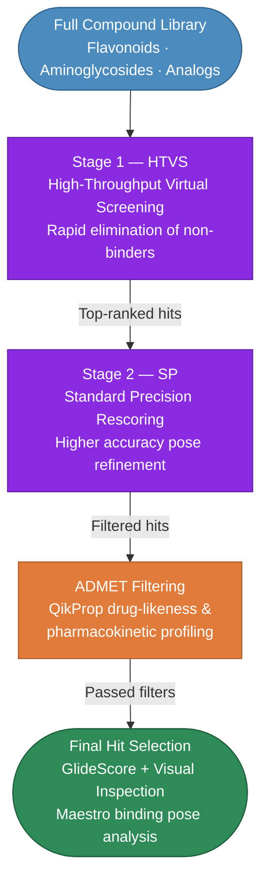

# Virtual Screening Data (VSW)


> High-throughput virtual screening of two compound libraries against AMR target 3" aminoglycoside nucleotidyltransferase (ANT) from *Acinetobacter baumannii* (AbANT) and *Staphylococcus aureus* (SaANT).

---

## Targets

| Target | Organism | UniProt | Structure Source |
|--------|----------|---------|-----------------|
| **AbANT** | *Acinetobacter baumannii* | [Q671Q4](https://www.uniprot.org/uniprotkb/Q671Q4) | Homology model — SWISS-MODEL (this study) |
| **SaANT** | *Staphylococcus aureus* | [P0A0D2](https://www.uniprot.org/uniprotkb/P0A0D2) | Homology model — SWISS-MODEL (this study) |

Homology models were refined using the **Schrödinger Protein Preparation Wizard (PrepWizard)** prior to docking grid generation.

---

## Compound Libraries

| Library | Description | Screened Against |
|---------|-------------|-----------------|
| **Flavonoids** | Plant-derived polyphenolic compounds | AbANT + SaANT |
| **Aminoglycosides** | Aminoglycoside antibiotic scaffolds and analogs | AbANT + SaANT |

---

## Docking Protocol

All virtual screening was performed using **Schrödinger Glide** via a two-stage funnel:



**ADMET filtering** was performed using **QikProp** (Schrödinger Suite 2022). Results are in `admet/`.

---

## Directory Structure

```
vsw/
├── aminoglycosides/
│   ├── raw/              # Glide HTVS & SP scored output CSVs
│   └── processed/        # Curated results 
├── flavonoids/
│   ├── raw/              # Glide HTVS & SP scored output CSVs
│   └── processed/        # Curated results 
├── analogs/
│   ├── raw/              # Glide output CSVs for analog screens
│   └── processed/        # Curated analog results 
└── admet/
    └──                   # QikProp ADMET descriptor CSVs (both libraries)
```

---

## File Naming Convention

| Pattern | Description |
|---------|-------------|
| `AbANT_vsw_*-HTVS_OUT.csv` | Raw HTVS GlideScores — AbANT |
| `SaANT_vsw_*-HTVS_OUT.csv` | Raw HTVS GlideScores — SaANT |
| `AbANT_vsw_*-SP_OUT.csv` | SP rescoring output — AbANT |
| `SaANT_vsw_*-SP_OUT.csv` | SP rescoring output — SaANT |
| `HTVS_results_*.csv` | Processed summary table |
| `vsw_*-QIKPROP.csv` | QikProp ADMET descriptors |

> **GlideScore** is reported in kcal/mol — more negative values indicate stronger predicted binding affinity.

---

##  Notes

- Full Schrödinger VSW job directories (`.maegz`, `.log`, `.dump`, intermediate pipeline files) are retained locally and are available on reasonable request.
- Analog screens (Gentamicin Analog 3, Dibekacin Analog 2, Plazomicin Analog 9) are deposited under `analogs/`.
- Results correspond to data reported in **Sikakane M. et al. (in preparation)**.

---

##  Citation

If you use this data, please cite the associated manuscript:

> Sikakane M. *et al.* (*in preparation*). Conformational dynamics and ligand recognition of  *Acinetobacter baumannii* versus it's *Staphylococcus aureus* orthologue. DOI: *to be added upon publication*.
